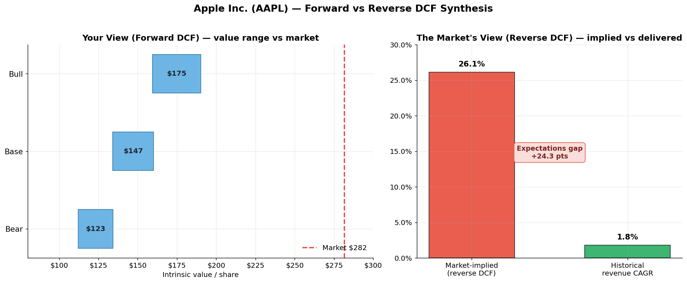

# DCF Valuation Engine — Forward & Reverse

**One discounted-cash-flow engine that values a public company two ways: *forward* to an intrinsic per-share value, and *reverse* to the growth rate the market is already pricing in.**

[](https://colab.research.google.com/github/YOUR_USERNAME/dcf-valuation-engine/blob/main/DCF_Valuation_Engine.ipynb)


---



*Example run on Apple (AAPL): the forward DCF puts intrinsic value well below the market price, while the reverse DCF shows the market is pricing in ~26% explicit-period growth against a ~1.8% historical revenue CAGR — a 24-point expectations gap.*

---

## The idea

Most DCF projects build a forward model: plug in growth and margin assumptions, discount the projected cash flows, get a "fair value." The problem is that the answer is only as good as the assumptions, and it's easy to reverse-engineer the inputs until the model says whatever you want.

This project flips the question. The **same engine** that runs forward can be inverted: hold the *current market price* fixed and solve backward for the growth rate that would justify it. That implied growth — benchmarked against what the company has actually delivered — reframes valuation as an *expectations debate* rather than a single number:

- **Your view** (forward): what is the company worth under bear / base / bull assumptions?
- **The market's view** (reverse): what does today's price assume, and is that realistic?

The design point: forward and reverse are not two models. They are **one `DCFModel` object queried for two different unknowns.**

## What it does

- **Forward DCF** — pulls live fundamentals, derives base-case operating drivers from the company's own history, builds a CAPM-based WACC, and projects unlevered free cash flow over an explicit horizon with **both** Gordon-growth and exit-multiple terminal values. Runs bear / base / bull scenarios and a **WACC × terminal-growth sensitivity heatmap**.
- **Reverse DCF** — wraps a numerical root-finder (Brent's method) around the identical engine to recover the **market-implied growth rate**, then compares it to the company's realized revenue CAGR.
- **Live data** — fundamentals from Yahoo Finance, risk-free rate from FRED (10-Year Treasury), with a graceful manual-input fallback so the notebook never hard-fails on a network hiccup or a missing API key.
- **Synthesis** — a football-field value range and an implied-vs-historical-growth comparison side by side, with an "expectations gap" verdict.

## Quick start

**Run it in your browser (no install):** click the **Open in Colab** badge above.

**Run it locally:**

```bash
git clone https://github.com/YOUR_USERNAME/dcf-valuation-engine.git
cd dcf-valuation-engine
pip install -r requirements.txt
jupyter notebook DCF_Valuation_Engine.ipynb
```

Then change one line in the **Configuration** cell to value a different company:

```python
CONFIG = {
    "TICKER": "AAPL",   # <-- change me
    ...
}
```

A [FRED API key](https://fred.stlouisfed.org/docs/api/api_key.html) is optional — leave it blank and the notebook uses documented fallback values for the risk-free rate.

## Methodology

| Component | Approach |
|---|---|
| **Free cash flow** | Unlevered FCF = NOPAT + D&A − Capex − ΔNWC, projected over a 5-year explicit horizon |
| **Cost of equity** | CAPM: risk-free + β × equity risk premium |
| **Cost of debt** | Inferred from interest expense / total debt where available, else config default; tax-adjusted |
| **WACC** | Market-value-weighted, clipped to `[MIN_WACC, MAX_WACC]` guardrails so the reverse solver can't be handed a degenerate rate |
| **Terminal value** | Two methods reported side by side: Gordon perpetuity growth **and** exit EV/EBITDA multiple |
| **Operating drivers** | EBIT margin, tax rate, D&A / Capex / NWC intensity estimated from the company's own statements where not overridden |
| **Reverse solve** | Brent's method root-finder on `intrinsic_value(growth) − market_price = 0` |

## Limitations

This is an **educational project, not investment advice.** Like any DCF, it is sensitive to its assumptions, and it makes deliberate simplifications:

- Single-stage explicit growth (no multi-stage fade)
- Net working capital approximated from a balance-sheet level rather than a full driver-by-driver build
- Relies on Yahoo Finance line items, whose schema shifts over time (hence the defensive lookups and manual fallback)
- Terminal value typically dominates the valuation, as it does in most DCFs — the sensitivity grid is there to make that dependence explicit

The point of the reverse mode is precisely to confront these limits: rather than defending one "right" number, it surfaces what assumptions the market is making so they can be argued with.

## Repo contents

```
.
├── DCF_Valuation_Engine.ipynb   # the full annotated notebook (with saved outputs)
├── hero_synthesis.png           # example output chart
├── requirements.txt
├── LICENSE
└── README.md
```

## License

MIT — see [LICENSE](LICENSE).
