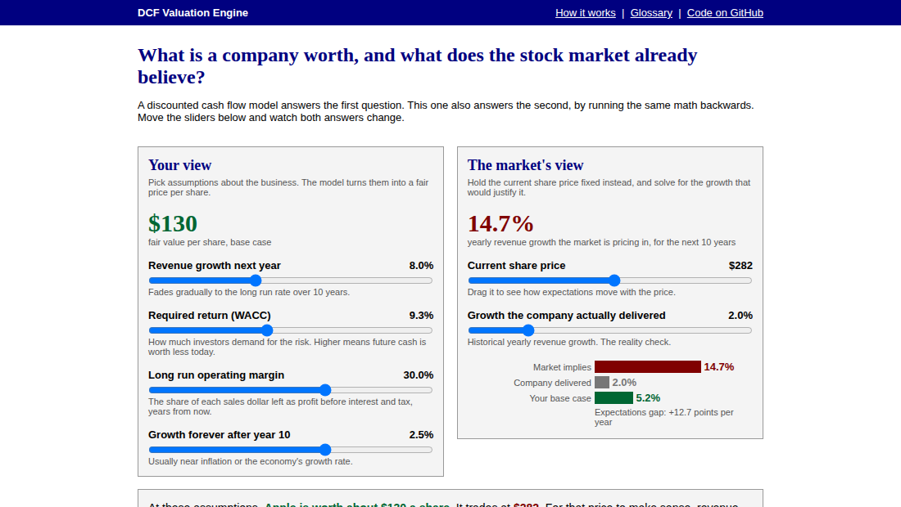
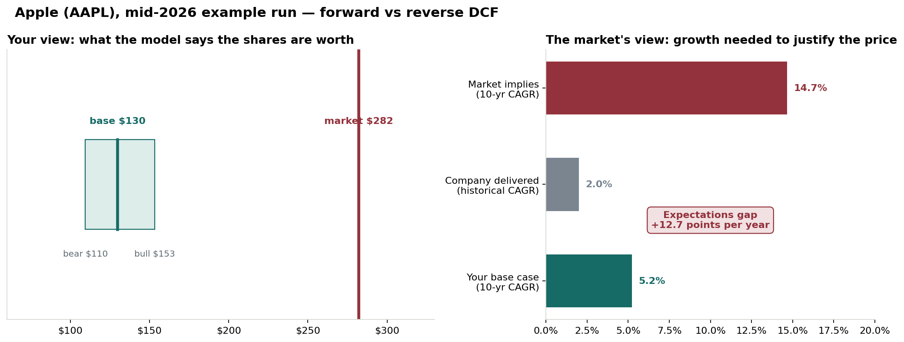
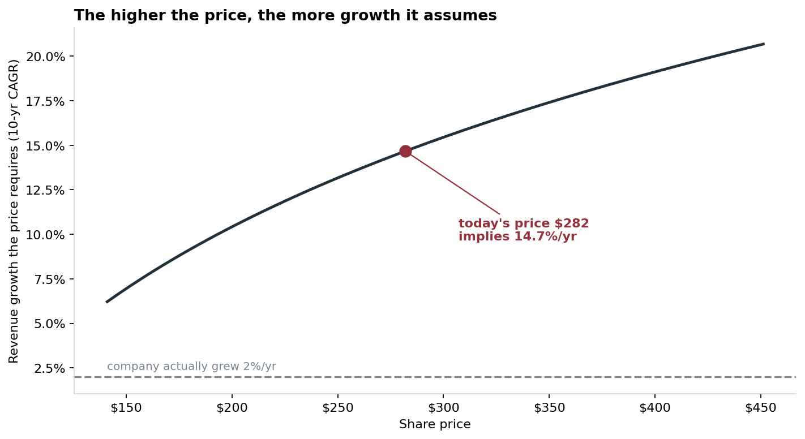

# DCF Valuation Engine

**What is a company worth - and what does the stock market already believe?**

Most valuation models answer the first question. This one also answers the second, by running the same math backwards.

**[Try the interactive version →](https://donmontilla.github.io/upgraded-dcf-engine/)** - move sliders, no code needed.

[](https://colab.research.google.com/github/donmontilla/upgraded-dcf-engine/blob/main/dcf_valuation_engine.ipynb)




---

## The one-minute version

A **discounted-cash-flow (DCF) model** estimates what a business is worth by forecasting the cash it will generate and translating that future cash into today's dollars. You feed it assumptions (how fast sales grow, how profitable the company stays, how risky it is) and it gives you a fair price per share.

The catch: the answer is only as good as the assumptions, and it is easy to nudge the inputs until the model says whatever you want.

So this engine also runs **in reverse**. Instead of guessing growth and getting a price, it takes the *actual* share price and solves for the growth rate that would justify it. That tells you what the market must be betting on. Compare it with what the company has historically delivered, and you have an argument instead of a single number.

| Direction | You give it | It tells you |
|---|---|---|
| **Forward** (your view) | Growth, margin, and risk assumptions | Fair value per share, with a bear-to-bull range |
| **Reverse** (the market's view) | Today's share price | The yearly growth the market is pricing in |

Both directions use the *same* function, solved for a different unknown. That is why the notebook can check itself: value a company forward, feed that price into the reverse solver, and it must recover the growth rate it started with.

## Example: Apple, mid-2026



Under conservative assumptions, the model values Apple at about **$130 a share**. It traded at **$282**. For that price to make sense, revenue would need to grow about **15% a year for ten years** - against a historical rate near **2%**. The 13-point gap is the debate. The tool does not settle it; it makes it visible and quantifies it.



*The reverse solver run across a range of prices: every price implies a growth rate, and the higher the price, the more growth it assumes.*

## Three ways to use it

1. **Look** The [interactive page](https://donmontilla.github.io/upgraded-dcf-engine/) runs the forward and reverse math in your browser with example inputs, and you can type in any company's numbers from its annual report.
2. **Run on any stock** Click the Colab badge above, change `CONFIG["TICKER"]`, and choose *Runtime → Run all*. It pulls live financials and prices, estimates every driver from the company's own history, and prints the full analysis with charts.
3. **Run locally**
   ```bash
   pip install -r requirements.txt
   jupyter notebook dcf_valuation_engine.ipynb
   ```
   A FRED API key is optional (`CONFIG["FRED_API_KEY"]`); without one the notebook uses a second no-key path and then a documented fallback. Never commit a real key.

## What the notebook does, step by step

1. **Pulls the data** Financial statements and price from Yahoo Finance; the 10-year Treasury yield from FRED. Every lookup is alias-tolerant and falls back gracefully, and a manual-input cell exists in case the automated pull fails.
2. **Estimates the drivers from history** rather than hard-coding them: long-run operating margin (multi-year average), tax rate, depreciation and capital spending as a share of revenue, and the working capital needed per dollar of *new* revenue.
3. **Estimates risk (beta) by regression** Five years of weekly stock returns regressed on the S&P 500 (SPY). The slope is beta; R² and sample size are reported. Yahoo's beta is kept only as a labeled fallback.
4. **Builds the discount rate (WACC)** from CAPM cost of equity, an after-tax cost of debt inferred from interest expense, and market-value weights.
5. **Forecasts ten years of free cash flow** Growth starts at the assumed year-1 rate and fades linearly to the terminal rate, so there is no artificial cliff at the hand-off to terminal value. Margin drifts toward its long-run level over the same horizon.
6. **Values the company two ways** at the terminal year - a perpetual-growth (Gordon) value and an EV/EBITDA exit multiple - and reports bear, base, and bull cases plus a WACC × terminal-growth sensitivity grid.
7. **Runs the reverse solve** Holds the market price fixed and finds, with a bracketed root-finder (`scipy.optimize.brentq`), the growth path that reproduces it. Reports both the implied year-1 rate and the implied 10-year CAGR; only the CAGR is compared to historical CAGR, because both are compound multi-year rates.
8. **Tests itself** A forward → reverse round-trip must recover the input growth to within 0.0001, and the value function must be strictly increasing in growth across the solver's range - the property that makes "the market-implied growth" a unique, well-defined number.

## Methodology (for finance readers)

Unlevered free cash flow each year is `FCF_t = EBIT_t·(1−τ) + D&A_t − Capex_t − ΔNWC_t`, where revenue growth `g_t` fades linearly from `g_start` to `g_terminal` over `N = 10` years and EBIT margin follows its own linear path to the long-run level. Enterprise value is the sum of discounted explicit-period FCF plus the discounted terminal value (Gordon: `FCF_N·(1+g_T)/(WACC−g_T)`, or exit: `multiple × EBITDA_N`). Equity value is EV less net debt; per-share value divides by shares outstanding. WACC uses CAPM cost of equity (`r_f + β·ERP`) with the OLS beta.

The reverse direction defines `f(g_start) = value(g_start) − market price` and finds its root with Brent's method. Because every year's growth increases with `g_start`, value is monotonic in `g_start`, so the root is unique whenever the price is reachable within the bracket. If it is not reachable, the solver says so rather than returning a wrong number - that itself is information: growth alone cannot reconcile the price under the current margin and WACC assumptions.

## Words used here

| Term | Plain English |
|---|---|
| Free cash flow | Cash the business generates after paying for what it needs to keep running and growing |
| Discounting | Translating a future dollar into what it is worth today; more time or more risk means a bigger haircut |
| WACC | The blended return lenders and shareholders require; used as the discount rate |
| Terminal value | One number standing in for all cash flows after year 10, assuming steady modest growth forever |
| Implied growth | The growth rate that makes the model's price equal the market's price - "what the market must believe" |
| CAGR | Compound annual growth rate: the single yearly rate that gets from the start value to the end value |
| Beta | How much a stock moves relative to the market as a whole; drives the required return |

## Limitations (read before quoting results)

Yahoo Finance typically returns only about four years of annual statements, so the historical CAGR - even estimated by log-linear regression - is a narrow-window figure; the notebook labels the window on every printout. The market-implied growth is conditional on the WACC and margin assumptions being the market's too; the WACC-sensitivity table exists to size that dependence, not hide it. The linear fade is one choice of growth-path shape, which is why the horizon CAGR, not the initial rate, is the headline number. The incremental working-capital ratio is estimated from a handful of yearly observations and falls back to a labeled level proxy when history is too thin. The interactive page uses fixed example inputs and a simplified version of the same math (Gordon terminal value only, bisection instead of Brent). None of this is investment advice.

## Repository structure

```
.
├── index.html                   # the interactive explainer (served by GitHub Pages)
├── dcf_valuation_engine.ipynb   # the engine: data pull, driver estimation, forward + reverse, self-tests
├── synthesis.png                # charts used in this README
├── interactive_page.png
├── implied_growth_curve.png
├── requirements.txt
├── CHANGELOG.md                 # v1 → v2: what was wrong and what was fixed
├── LICENSE
└── README.md
```

## Changelog

v2 fixed a set of weaknesses found in a structured self-review of v1, including a conceptual error in the working-capital driver and a fragile endpoint-based CAGR. See [CHANGELOG.md](CHANGELOG.md).

## Development notes

Developed with AI-assisted coding. The modeling decisions - growth-path structure, driver estimation choices, validation design, and the interpretation framework - are my own, and the methodology above is documented at the level I can defend in conversation.

## Author

**Don Montilla** - B.S. Business Economics, UC San Diego · [LinkedIn](https://www.linkedin.com/in/donalfonso/)

Licensed under the [MIT License](LICENSE).
